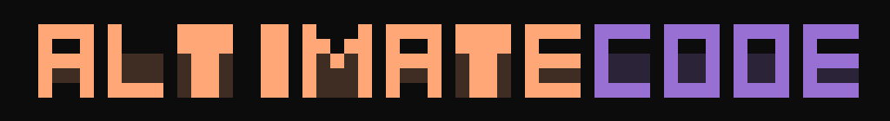

<style>
.md-content h1:first-child { display: none; }
.hero img { max-width: 280px; image-rendering: -webkit-optimize-contrast; image-rendering: crisp-edges; }
</style>

<div class="hero" markdown>

<p align="center">
  
</p>

<p class="hero-tagline">Open-source data engineering harness.</p>

<p class="hero-description">100+ specialized data engineering tools for building, validating, optimizing, and shipping data products. Use in your terminal, CI pipeline, orchestration DAGs, or as the harness for your data agents. Evaluate across platforms, independent of any single warehouse provider.</p>

<p class="hero-actions" markdown>

[Get Started](/getting-started/quickstart/){ .md-button .md-button--primary }
[See Examples](/examples/){ .md-button }
[View on GitHub :material-github:](https://github.com/AltimateAI/altimate-code){ .md-button }

</p>

</div>

<div class="hero-install" markdown>

```bash
npm install -g altimate-code
```

</div>

---

<h2 class="section-heading">Why Altimate Code?</h2>
<p class="section-sub">Every major data platform is building AI agents, but they're all locked to one ecosystem. Your data stack isn't. Altimate Code connects to your <strong>entire</strong> stack and lets you bring <strong>any LLM</strong>. No vendor lock-in, no platform tax.</p>

<div class="nt-cards nt-grid cols-3" markdown>

<div class="nt-card" markdown>
<div class="nt-card-content" markdown>
<div class="ak-card-icon">
<svg viewBox="0 0 24 24" fill="none" stroke="currentColor" stroke-linecap="round" stroke-linejoin="round"><path d="M17.5 19a4.5 4.5 0 1 0-2.45-8.28A6.5 6.5 0 0 0 4 13.5a4.5 4.5 0 0 0 4.5 4.5h9z"/></svg>
</div>

### [Bring Your Own LLM](/configure/providers/)

Works with Anthropic, OpenAI, Google, AWS Bedrock, Azure, Ollama, and 10+ more providers — or run fully local with `altimate local`, no API key. Swap models without swapping your harness. No vendor lock-in.

</div>
</div>

<div class="nt-card" markdown>
<div class="nt-card-content" markdown>
<div class="ak-card-icon">
<svg viewBox="0 0 24 24" fill="none" stroke="currentColor" stroke-linecap="round" stroke-linejoin="round"><rect x="3" y="3" width="7" height="7" rx="1"/><rect x="14" y="3" width="7" height="7" rx="1"/><rect x="3" y="14" width="7" height="7" rx="1"/><rect x="14" y="14" width="7" height="7" rx="1"/></svg>
</div>

### [Cross-Platform](/usage/tui/)

Claude Code, Cursor, Windsurf, VS Code, and any MCP-compatible client. Terminal, IDE, CI, or web. One install, everywhere.

</div>
</div>

<div class="nt-card" markdown>
<div class="nt-card-content" markdown>
<div class="ak-card-icon">
<svg viewBox="0 0 24 24" fill="none" stroke="currentColor" stroke-linecap="round" stroke-linejoin="round"><path d="M14.7 6.3a4 4 0 0 0-5.4 5.4l-7 7 2 2 7-7a4 4 0 0 0 5.4-5.4l-3 3-2-2 3-3z"/></svg>
</div>

### [100+ Deterministic Tools](/configure/tools/)

SQL analysis, column-level lineage, dbt integration, FinOps, warehouse connectivity. Purpose-built for data work, not hallucinated by a model.

</div>
</div>

<div class="nt-card" markdown>
<div class="nt-card-content" markdown>
<div class="ak-card-icon">
<svg viewBox="0 0 24 24" fill="none" stroke="currentColor" stroke-linecap="round" stroke-linejoin="round"><path d="M12 22s8-4 8-10V5l-8-3-8 3v7c0 6 8 10 8 10z"/><path d="m9 12 2 2 4-4"/></svg>
</div>

### [Validation Layer](/data-engineering/validators/)

SQL, lineage, and equivalence checks run in compiled Rust, not the model. 100% F1 across 1,077 anti-pattern queries, ~2 ms each, zero tokens.

</div>
</div>

<div class="nt-card" markdown>
<div class="nt-card-content" markdown>
<div class="ak-card-icon">
<svg viewBox="0 0 24 24" fill="none" stroke="currentColor" stroke-linecap="round" stroke-linejoin="round"><polygon points="13 2 3 14 12 14 11 22 21 10 12 10 13 2"/></svg>
</div>

### [Token Efficiency](/configure/context-management/)

Context compaction trims the schema payload per task. The model gateway routes each call to the cheapest model that clears your accuracy bar.

</div>
</div>

<div class="nt-card" markdown>
<div class="nt-card-content" markdown>
<div class="ak-card-icon">
<svg viewBox="0 0 24 24" fill="none" stroke="currentColor" stroke-linecap="round" stroke-linejoin="round"><path d="M12 22s8-4 8-10V5l-8-3-8 3v7c0 6 8 10 8 10z"/></svg>
</div>

### [Data Governance](/configure/governance/)

Built-in PII detection, policy enforcement, and compliance validation across your data stack. Three agent modes — Builder, Analyst, Plan — with tool-level permissions.

</div>
</div>

</div>

<div class="ak-needs-rows ak-needs-rows--orange" markdown>

<a href="https://github.com/AltimateAI/altimate-code" class="ak-need-row ak-need-row--orange" target="_blank" rel="noopener">
<span class="ak-need-row-ico ak-need-row-ico--orange"><svg viewBox="0 0 24 24" fill="none" stroke="currentColor" stroke-width="1.8" stroke-linecap="round" stroke-linejoin="round"><path d="M9 19c-5 1.5-5-2.5-7-3m14 6v-3.87a3.37 3.37 0 0 0-.94-2.61c3.14-.35 6.44-1.54 6.44-7A5.44 5.44 0 0 0 20 4.77 5.07 5.07 0 0 0 19.91 1S18.73.65 16 2.48a13.38 13.38 0 0 0-7 0C6.27.65 5.09 1 5.09 1A5.07 5.07 0 0 0 5 4.77a5.44 5.44 0 0 0-1.5 3.78c0 5.42 3.3 6.61 6.44 7A3.37 3.37 0 0 0 9 18.13V22"/></svg></span>
<span class="ak-need-row-body"><strong>Open source &amp; auditable</strong><span>Every tool, prompt and rule is inspectable on GitHub. A requirement for regulated industries, not a nice-to-have.</span></span>
<svg class="ak-need-row-arrow" viewBox="0 0 24 24" fill="none" stroke="currentColor" stroke-width="2" stroke-linecap="round" stroke-linejoin="round"><path d="M5 12h14"/><path d="m12 5 7 7-7 7"/></svg>
</a>

<a href="/configure/agents/" class="ak-need-row ak-need-row--orange">
<span class="ak-need-row-ico ak-need-row-ico--orange"><svg viewBox="0 0 24 24" fill="none" stroke="currentColor" stroke-width="1.8" stroke-linecap="round" stroke-linejoin="round"><circle cx="12" cy="12" r="3"/><path d="M19.4 15a1.65 1.65 0 0 0 .33 1.82l.06.06a2 2 0 1 1-2.83 2.83l-.06-.06a1.65 1.65 0 0 0-1.82-.33 1.65 1.65 0 0 0-1 1.51V21a2 2 0 1 1-4 0v-.09a1.65 1.65 0 0 0-1-1.51 1.65 1.65 0 0 0-1.82.33l-.06.06a2 2 0 1 1-2.83-2.83l.06-.06a1.65 1.65 0 0 0 .33-1.82 1.65 1.65 0 0 0-1.51-1H3a2 2 0 1 1 0-4h.09a1.65 1.65 0 0 0 1.51-1 1.65 1.65 0 0 0-.33-1.82l-.06-.06a2 2 0 1 1 2.83-2.83l.06.06a1.65 1.65 0 0 0 1.82.33h0a1.65 1.65 0 0 0 1-1.51V3a2 2 0 1 1 4 0v.09a1.65 1.65 0 0 0 1 1.51h0a1.65 1.65 0 0 0 1.82-.33l.06-.06a2 2 0 1 1 2.83 2.83l-.06.06a1.65 1.65 0 0 0-.33 1.82v0a1.65 1.65 0 0 0 1.51 1H21a2 2 0 1 1 0 4h-.09a1.65 1.65 0 0 0-1.51 1z"/></svg></span>
<span class="ak-need-row-body"><strong>Customizable to your workflow</strong><span>Bring your own rules, agents, skills and tools. Match your company's data conventions and testing patterns.</span></span>
<svg class="ak-need-row-arrow" viewBox="0 0 24 24" fill="none" stroke="currentColor" stroke-width="2" stroke-linecap="round" stroke-linejoin="round"><path d="M5 12h14"/><path d="m12 5 7 7-7 7"/></svg>
</a>

</div>

---

<h2 class="section-heading">100+ specialized tools</h2>
<p class="section-sub">Unlike general-purpose coding agents, every tool is purpose-built for data engineering workflows.</p>

<div class="nt-cards nt-grid cols-3" markdown>

<div class="nt-card" markdown>
<div class="nt-card-content" markdown>
<div class="ak-card-icon">
<svg viewBox="0 0 24 24" fill="none" stroke="currentColor" stroke-linecap="round" stroke-linejoin="round"><circle cx="11" cy="11" r="7"/><line x1="21" y1="21" x2="16.65" y2="16.65"/></svg>
</div>

### [SQL Anti-Pattern Detection](/data-engineering/tools/sql-tools/)

19 rules with confidence scoring. Catches SELECT *, missing filters, cartesian joins, non-sargable predicates, and more. 100% accuracy across 1,077 benchmark queries.

</div>
</div>

<div class="nt-card" markdown>
<div class="nt-card-content" markdown>
<div class="ak-card-icon">
<svg viewBox="0 0 24 24" fill="none" stroke="currentColor" stroke-linecap="round" stroke-linejoin="round"><circle cx="18" cy="18" r="3"/><circle cx="6" cy="6" r="3"/><circle cx="6" cy="18" r="3"/><path d="M6 9v6"/><path d="M9 18h6"/><path d="M9 6h6a3 3 0 0 1 3 3v6"/></svg>
</div>

### [Live Column-Level Lineage](/data-engineering/tools/lineage-tools/)

Real-time lineage extraction from SQL. Trace any column back through joins, CTEs, and subqueries to its source. Not a cached graph — a living lineage that updates with every change.

</div>
</div>

<div class="nt-card" markdown>
<div class="nt-card-content" markdown>
<div class="ak-card-icon">
<svg viewBox="0 0 24 24" fill="none" stroke="currentColor" stroke-linecap="round" stroke-linejoin="round"><line x1="12" y1="1" x2="12" y2="23"/><path d="M17 5H9.5a3.5 3.5 0 0 0 0 7h5a3.5 3.5 0 0 1 0 7H6"/></svg>
</div>

### [FinOps & Cost Analysis](/data-engineering/tools/finops-tools/)

Credit analysis, expensive query detection, warehouse right-sizing, and unused resource cleanup. Specific optimization recommendations with estimated savings.

</div>
</div>

<div class="nt-card" markdown>
<div class="nt-card-content" markdown>
<div class="ak-card-icon">
<svg viewBox="0 0 24 24" fill="none" stroke="currentColor" stroke-linecap="round" stroke-linejoin="round"><polyline points="4 7 4 4 20 4 20 7"/><line x1="9" y1="20" x2="15" y2="20"/><line x1="12" y1="4" x2="12" y2="20"/></svg>
</div>

### [Cross-Dialect Translation](/data-engineering/tools/sql-tools/)

Deterministic engine translating SQL between Snowflake, BigQuery, Databricks, Redshift, PostgreSQL, MySQL, SQL Server, and DuckDB with lineage verification.

</div>
</div>

<div class="nt-card" markdown>
<div class="nt-card-content" markdown>
<div class="ak-card-icon">
<svg viewBox="0 0 24 24" fill="none" stroke="currentColor" stroke-linecap="round" stroke-linejoin="round"><rect x="3" y="11" width="18" height="11" rx="2" ry="2"/><path d="M7 11V7a5 5 0 0 1 10 0v4"/></svg>
</div>

### [PII Detection & Safety](/configure/governance/)

Automatic column scanning across 15+ PII categories. Safety checks and policy enforcement before every query touches production.

</div>
</div>

<div class="nt-card" markdown>
<div class="nt-card-content" markdown>
<div class="ak-card-icon">
<svg viewBox="0 0 24 24" fill="none" stroke="currentColor" stroke-linecap="round" stroke-linejoin="round"><ellipse cx="12" cy="5" rx="9" ry="3"/><path d="M3 5v14c0 1.66 4 3 9 3s9-1.34 9-3V5"/><path d="M21 12c0 1.66-4 3-9 3s-9-1.34-9-3"/></svg>
</div>

### [dbt Native](/data-engineering/tools/dbt-tools/)

Manifest parsing, test generation, model scaffolding, incremental model detection, and lineage-aware refactoring. Builds models that fit your project conventions.

</div>
</div>

</div>

---

<h2 class="section-heading">See it in action</h2>
<p class="section-sub">Build dbt models from Jira tickets, find broken Snowflake views, optimize warehouse costs, migrate PySpark to dbt, debug Airflow DAGs, and more — all from your terminal.</p>

```bash

# Analyze a query for anti-patterns and optimization opportunities
> Analyze this query for issues: <query code> or <query id from warehouse>

# Translate SQL across dialects
> /sql-translate this Snowflake query to BigQuery: <query-code>

# Get a cost report for your Snowflake or Databricks account
> /cost-report

# Scaffold a new dbt model following your project patterns
> /model-scaffold fct_revenue from stg_orders and stg_payments

# Generate column level lineage report for sensitive columns
# from a particular table and identify owners
> Trace the lineage for email_id and name columns from
  customer_data.customer_info table and generate a report
  of where sensitive data is replicated with table owners info

# Migrate PySpark jobs to dbt models
> Migrate this PySpark ETL to a dbt model: <path to PySpark file>

# Debug a failing Airflow DAG
> Debug this Airflow DAG failure: <DAG id or error log>
```

<p class="section-sub" markdown>[:octicons-arrow-right-24: Browse more examples](/examples/)</p>

---

<h2 class="section-heading">Benchmarks</h2>
<p class="section-sub">Precision matters. Here's where we stand.</p>

| Benchmark | Result |
|---|---|
| **ADE-Bench (DuckDB Local)** | **74.4%** pass rate (32/43 tasks) — 15.4 points ahead of dbt Fusion+MCP (59%). |
| **SQL Anti-Pattern Detection** | 100% accuracy across 1,077 queries, 19 categories. Zero false positives. |
| **Column-Level Lineage** | 100% edge match across 500 queries with complex joins, CTEs, and subqueries. |
| **Snowflake Query Optimization (TPC-H)** | 16.8% average execution speedup (3.6x vs baseline). |

<p class="section-sub" markdown>[:octicons-arrow-right-24: Full benchmark details](https://altimate.ai/benchmarks/?utm_source=altimate-code&utm_medium=docs)</p>

---

<div class="doc-links" markdown>

**Learn More** — [Quickstart](/getting-started/quickstart/) | [Examples](/examples/) | [Use](/data-engineering/agent-modes/) | [Configure](/configure/) | [Interfaces](/usage/tui/) | [Reference](/reference/security-faq/)

</div>
