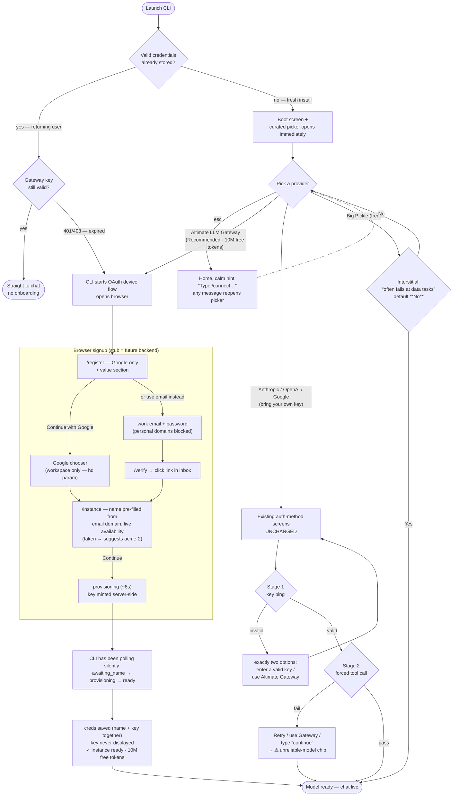
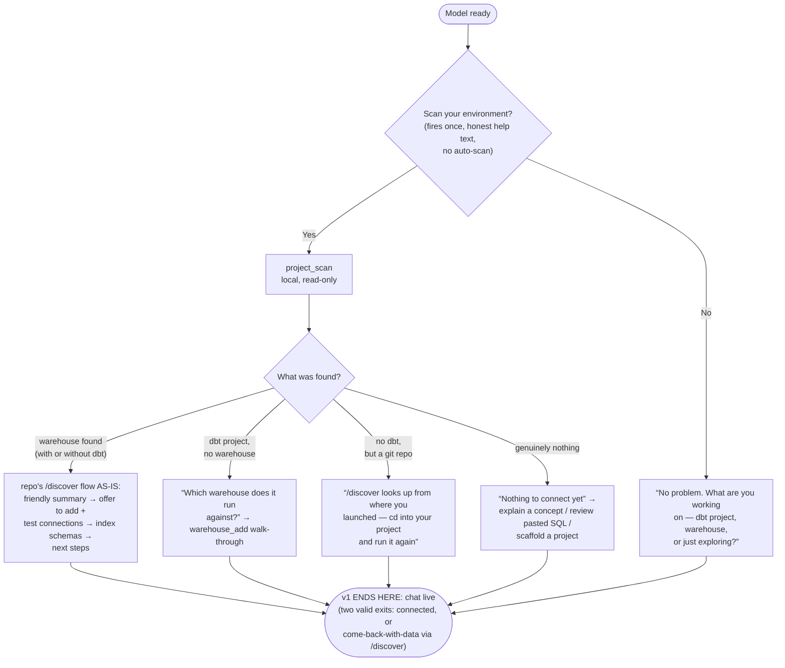
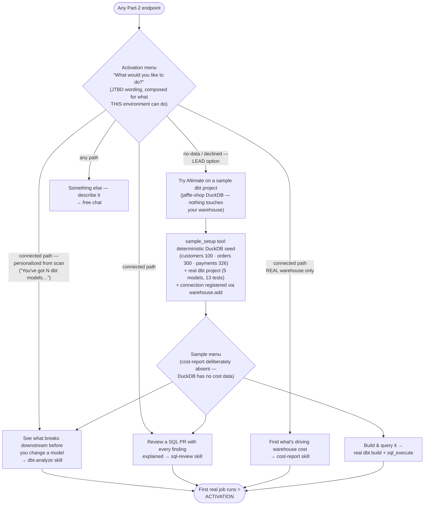

# Onboarding Flow Diagrams

*v1 (`plg-onboarding-prototype`) = Diagram 1 + Diagram 2.*
*v2 (`plg-onboarding-prototype-v2`) = Diagram 1 + Diagram 2 + Diagram 3.*
The two versions are identical through the scan gate; v2 continues every Part-2
endpoint into the activation menu instead of stopping at chat-live.

GitHub renders these Mermaid blocks natively.

---

## Diagram 1 — Part 1: get a working model (both versions)

Invariant: chat is unreachable until READY — enforced by guidance (picker-first,
filtered slash menu, submit gate that opens the picker), never by error copy.

---

## Diagram 2 — Part 2: connect the data environment (both versions)

No branch ever ends on a bare “nothing found” — every outcome converts into a
connection, a question, or a concrete next action.

---

## Diagram 3 — Part 3: activation menu + sample (v2 only)

Selecting a job **starts** it (skills are the verified built-ins: `dbt-analyze`,
`sql-review`, `cost-report`) — the menu is the last menu the user sees.
